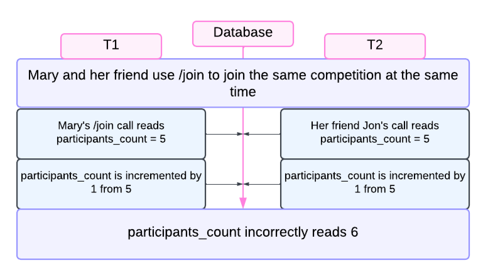
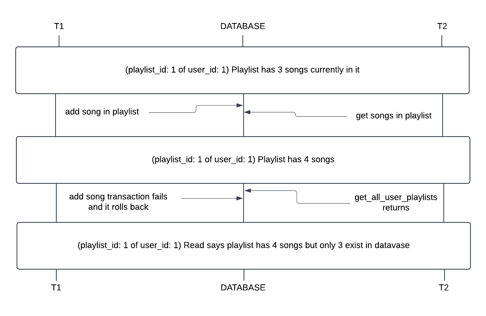
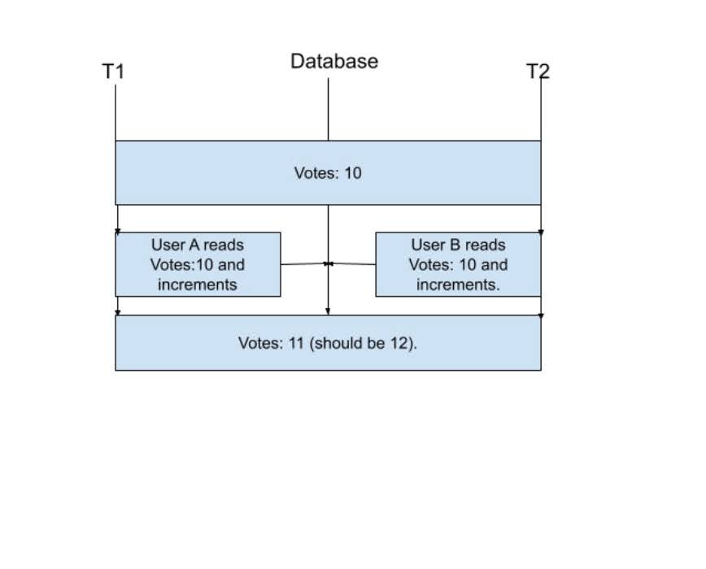

## Concurrency Issues

### CASE 1: ###
One potential concurrency issue in the `/competitions` endpoint involves the status of the competition changing at the same time as another endpoint is attempting to read it. For example, if two people are attempting to use `/join`, both will read and increment the same initial value, adding one participant to the count instead of two.

To resolve this, we can incorporate locking so that only one transaction can change the table at a time. 

### CASE 2: ###
A potential concurrency issue is possible in the users.py endpoint with `/{user_id}/all/playlists`. The function, get_all_user_playlists(user_id: int), retrieves all the playlists under a specific user id. If the user is adding or removing songs to a playlist in a live competition while this function is being called, it can result in a dirty read if the user’s actions are rolled back after the initial SELECT. To ensure this issue does not occur, we can set the isolation level of users’ playlists and transactions to a repeatable read level, so that only committed changes (additions/removals of songs) can be read. In addition, on a code logic path, we can add in SQL to only read playlists from finished competitions where changes should not occur to the playlist.

### CASE 2: ###
A potential concurrency issue could occur in the `/votes` endpoint that allows users to vote for
their favorite songs in a competition. The function for it, vote_for_song(user_id: int, song_id: int), increments the vote count for a song when a user votes. However, if two users vote for the same songs at the exact same time, the system could experience a lost update issue. This means one of the increments could be overwritten, and the final vote count might reflect only one vote instead of two. To resolve this issue, we can use database-level locking mechanisms like FOR UPDATE in SQL or ensure that this transaction is executed at a Serializable isolation level. This prevents two transactions from modifying the same row simultaneously. 

